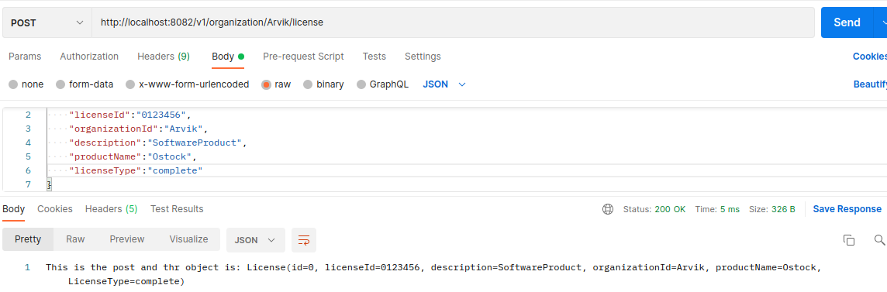
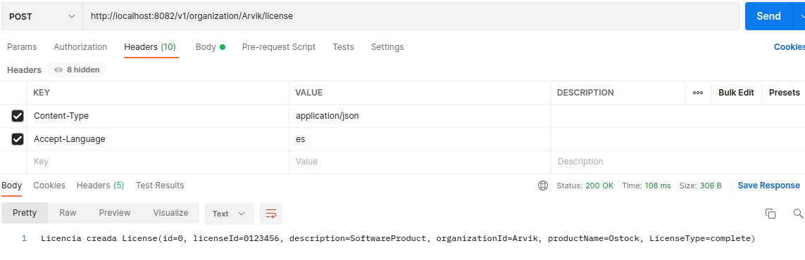

## License-microservice
Получаем лицензию, имитация без записи в бд, добавлена локаль 
 
Локаль пользуем, в зависимости от того что указано в Accept-Language

### Контакты для связи 
 arvikvan@gmail.com 
 @ArvikV

###Используемые технологии:
- Gradle
- Spring Boot
- REST

