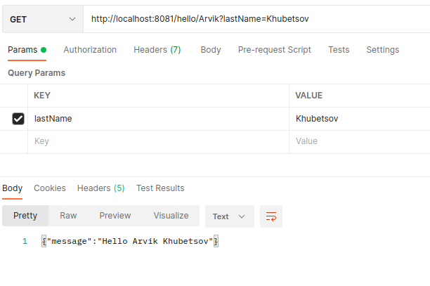

## Simple-microservice
Получаем ответ в json формате, при вводе параметров в строку адреса 

### Контакты для связи 
 arvikvan@gmail.com 
 @ArvikV

###Используемые технологии:
- Gradle
- Spring Boot
- REST

